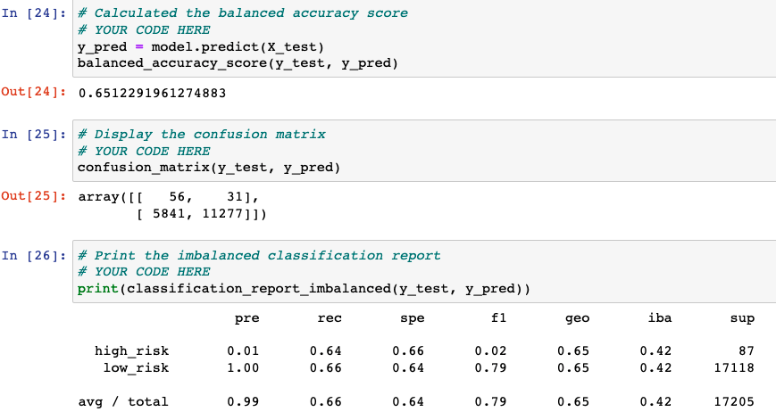

# Credit_Risk_Analysis

## Overview

The purpose of this analysis was to determine which machine learning module would best be able to identify good loans versus risky loans based on a standard set of features about the loans. 

The six different modules tested to predict loan risk were the following:

1. RandomOverSampler
    - resample the data by oversampling from existing observations, then train a logistic regression classifier with this new dataset
    - imbalanced-learn and scikit-learn libraries used
2. SMOTE
    - resample the data by oversampling from synthetically produced observations, then train a logistic regression classifier with this new dataset
    - imbalanced-learn and scikit-learn libraries used
3. ClusterCentroids
    - resample the data by undersampling, then train a logistic regression classifier with this new dataset
    - imbalanced-learn and scikit-learn libraries used
4. SMOTEENN
    -  resample the data by using a combinatorial approach of over- and understampling, then train a logistic regression classifier with this new dataset
    - imbalanced-learn and scikit-learn libraries used
5. BalancedRandomForestClassifer
    - resample the dataset and then train this ensemble classifer on the sampled data
    - imblearn.esemble libary used
6. EasyEnsembleClassifer
    - resample the dataset and then train this ensemble classifer on the sampled data
    - imblearn.esemble libary used

Naive oversampling - hoorible precision, made a lot of false positives
these models work best with balanced datasets, so many 1s compared to zeros so doesnt predict zeros well

Smote - this doesnt help in improving model performance

## Results

**1. RandomOverSampler**

    - Accuracy Score: 65%
    - Precision (for high-risk loans): 0.01
    - Recall (for high-risk loans): 0.63

This RandomOverSampler model has a 65% **accuracy score**, which is in the mid-high range compared to the other modules tested. The **recall score**, which shows how likely all of the actually bad loans will be flagged for riskiness, is around 0.63, which is in the middle of the pack compared to the other models. Finally, the **precision score** is 0.01, which is very low. This means the model is flagging a lot of unrisky loans as risky, and therefore is not precise due to the high number of false positives it produces. 

**2. SMOTE**

    - Accuracy Score: 65%
    - Precision (for high-risk loans): 0.01
    - Recall (for high-risk loans): 0.64

The SMOTE model performed almost the same as the RandomOverSampler. That is, the model's accuracy score was in the middle of the pack compared ot the other models, and its recall score is decent at 0.64, meaning it will be able to catch the majority of all risky loans. However, it will classify a lot of loans as risky that are in fact not (false positives), which is why it has a very low precision score. 

**3. ClusterCentroids**

    - Accuracy Score: 52%
    - Precision (for high-risk loans): 0.01
    - Recall (for high-risk loans): 0.57

The ClusterCentroids model performed the worst of all models. It has the lowest accuracy score at 52%, the lowest recall score at 0.57, and is also tied for the lowest precision score at 0.01. This means it will have the highest number of both false negatives and false positives compared to all of the other models, and overall will not do a very good job of discerning between risky and healthy loans. 

**4. SMOTEENN**

    - Accuracy Score: 64%
    - Precision (for high-risk loans): 0.01
    - Recall (for high-risk loans): 0.70

This SMOTEENN model had a 1% worse accuracy score than the over the two oversampling models, but had a slightly higher recall score at 0.70. The SMOTEENN model therefore will catch more of the risky loans (because of its higher sensitivity score aka recall) than the oversampling models, but it will overall misclassify more of the loans by a slight amount. SMOTEENN did not perform as well as the two following classifer models.

**5. BalancedRandomForestClassifer**

    - Accuracy Score: 79%
    - Precision (for high-risk loans): 0.04
    - Recall (for high-risk loans): 0.67

The BalancedRandomForestClassifier model tied for the best model of all of the ones tested to flag risky loans. Its accuracy score is 79%, which is one of the highest. Its precision score was 4x higher than all of the sampling models, meaning it has fewer false positives. This model works by randomly under-sampling the data set many times (in this case 100) and running each small sample in a "random forest" like model. 

**6. EasyEnsembleClassifer**

    - Accuracy Score: 79%
    - Precision (for high-risk loans): 0.04
    - Recall (for high-risk loans): 0.67

The EasyEnsembleClassifier performed the same as the BalancedRandomForestClassifer. This model works as an esemble of AdaBoost "learners" trained on different balanced samples, samples built through random under-sampling. The AdaBoost algorithm is one method of learning from weaker classifers many times over, and then aggregating the learnings of those weaker classifiers into stronger ones. 

## Summary

The goal was to find the best model to predict risky loans. Since the number of risky loans within the total loans dataset is very small, it's most important to make sure that the model doesn't miss any of the risky loans (false negatives/low recall). At the same time, if in order to make sure that all risky loans are caught, the model also flags many low-risk loans as risky (false positives/low precision), then the model doesn't really help save any time or energy since a lot of good loans that were flagged will have to be reviewed manually. 

The ClusterCentroids model (undersampling) performed the worst, followed by the SMOTTEENN model (combinatorial under- and oversampling). The two oversampling models (RandomOversampler and SMOTE) performed decently, while the ensemble models (BalancedRandomForestClassifer and EasyEnsembleClassifier) performed the best relatively. However, the precision of all models was very low (many false positives of risky loans produced), and therefore I would not recommend using any of these models to predict risky loans. 